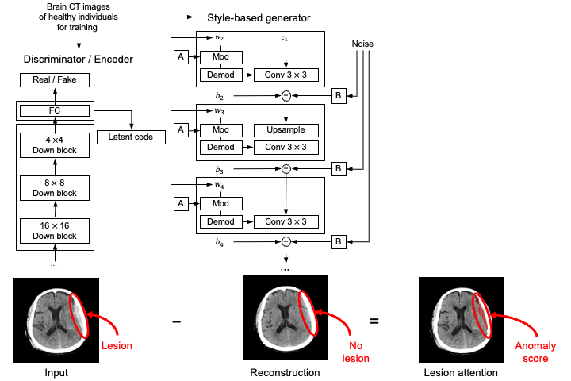
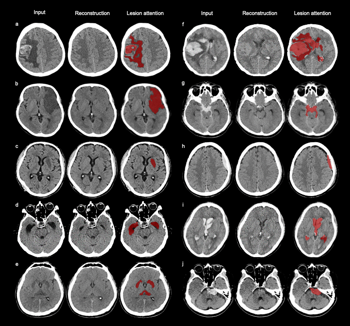

# Emergency triage of brain computed tomography via anomaly detection with a deep generative-model





This repository contains the official Pytorch implementation of the following paper:

> **[Emergency triage of brain computed tomography via anomaly detection with a deep generative model](https://www.nature.com/articles/s41467-022-31808-0)**<br>
> Seungjun Lee, Boryeong Jeong, Minjee Kim, Ryoungwoo Jang, Wooyul Paik, Jiseon Kang, Won Jung Chung, Gil-Sun Hong & Namkug Kim<br>
> https://www.nature.com/articles/s41467-022-31808-0
> 
> **Abstract:** Triage is essential for the early diagnosis and reporting of neurologic emergencies. Herein, we report the development of an anomaly detection algorithm (ADA) with a deep generative model trained on brain computed tomography (CT) images of healthy individuals that reprioritizes radiology worklists and provides lesion attention maps for brain CT images with critical findings. In the internal and external validation datasets, the ADA achieved area under the curve values (95% confidence interval) of 0.85 (0.81–0.89) and 0.87 (0.85–0.89), respectively, for detecting emergency cases. In a clinical simulation test of an emergency cohort, the median wait time was significantly shorter post-ADA triage than pre-ADA triage by 294 s (422.5 s [interquartile range, IQR 299] to 70.5 s [IQR 168]), and the median radiology report turnaround time was significantly faster post-ADA triage than pre-ADA triage by 297.5 s (445.0 s [IQR 298] to 88.5 s [IQR 179]) (all p < 0.001).

For business inquiries, please refer to namkugkim@gmail.com

## 1. System requirements

The package development version is tested on Linux (Ubuntu >= 16.04) operating systems. The developmental version of the package has been tested on the following systems:

* Python >= 3.8.5
* PyTorch >= 1.3.1
* CUDA >= 10.1/10.2

This implementation requires GPU acceleration for optimal performance. 
We have tested the code with the following specs:

- CPU: 12 cores, Intel(R) Xeon(R) CPU E5-2603 v4 @ 1.70GHz
- RAM: 16 GB
- GPU: 4 GPUs, Titan RTX 8000 

## 2. Installation guide

### Docker installation
Please follow the links below to install docker.

* Docker installation: https://docs.docker.com/engine/install/ubuntu/
* Nvidia Docker installation: https://docs.nvidia.com/datacenter/cloud-native/container-toolkit/install-guide.html

### Docker container
Using the following codes, you can install docker container.

```
$ sudo docker build ./ -t ubuntu/cnstylegan:latest # Be sure to be inside the project directory
$ sudo docker run --gpus all --restart=always --shm-size=128G -dit --name cnstylegan -v /mnt:/mnt -p 8888:8888 ubuntu/cnstylegan
$ sudo docker exec -it cnstylegan bash
```
which should install in about 30 minutes.

## 3.Usage
You can either train the model from scratch or use pretrained model checkpoint

### Training
In order to train the model from scratch, use following codes:

```
python3 -m torch.distributed.launch --nproc_per_node=<n_gpus> --master_port=8888 train.py --data_path=[TRAINING DATASET]
python3 -m torch.distributed.launch --nproc_per_node=<n_gpus> --master_port=8888 train_encoder.py --data_path=[TRAINING DATASET]`
```

### Pretrained model checkpoint
To use pretrained model checkpoint, download following files and place at the project directory.
- model checkpoint: https://mysnu-my.sharepoint.com/:u:/g/personal/lsjj096_seoul_ac_kr/EQj0QNwv5Q1MriLA8VOm30sBBWltrhiE6YHZWf6lWUMDWA
- latent statistics: https://mysnu-my.sharepoint.com/:u:/g/personal/lsjj096_seoul_ac_kr/EfUe0kqBaWZFjJ_0VioXcZ4BjI5fVQt550KS3KhO_KbZxw

### Project images to latent space
Use following code to project images to latent space and perform anomaly detection

`$ python projector.py --query_save_path=[DATASET_PATH]`

- To run the demo code: `$ python projector.py --query_save_path=./demos` which takes about 5 minutes for each CT scan


## License
This project is covered under the **GNU GENERAL PUBLIC LICENSE Version 3 (GPLv3)**.
